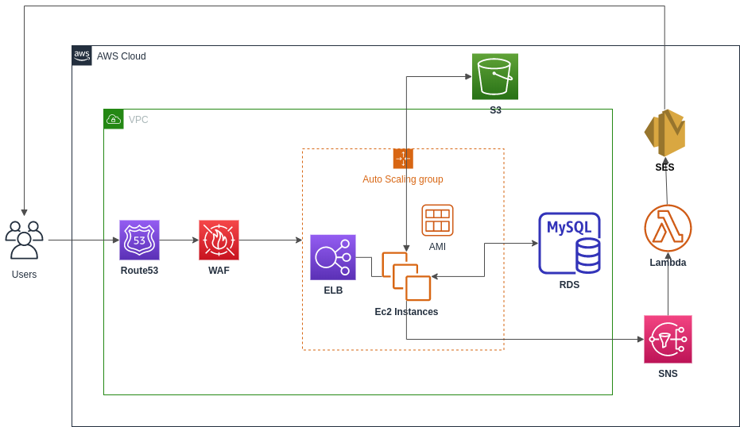
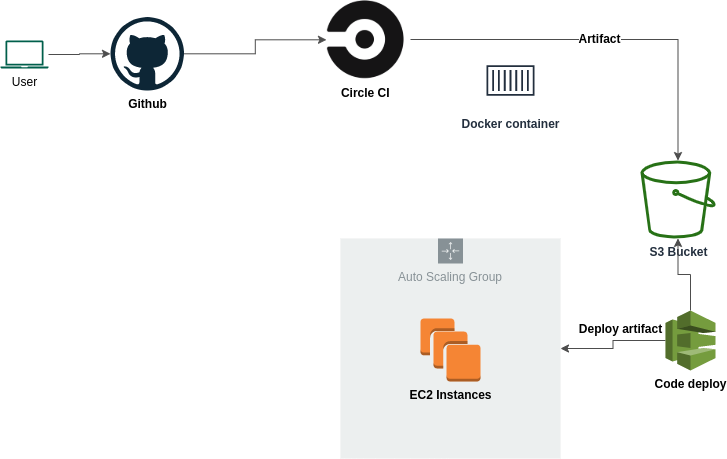
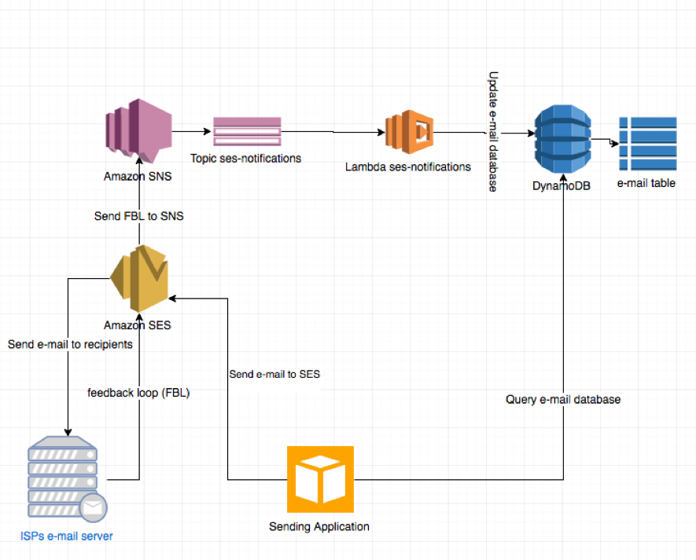

# DevOps - AWS

## Deploying web app on AWS using DevOps Principles

### Summary

User bill Tracking application build with spring boot, maven, REST APIs and deployed on AWS using CI/CD.

* EC2 instances are built on a custom AMI using Hashicorp packer
* Setting up the network and creation of resources is automated with AWS Cloud formation, aws cli and shell scripts
* Instances are autoscaled with ELB to handle the web traffic
* Created a serverless application to facilitate the password reset functionality using SES and SNS
* The application is deployed with Circle CI and AWS Code Deploy

### Architecture Diagram
 

### Tools and Technologies

|                      |               |   
| -------------        |:-------------:| 
| Infrastructure       | VPC, ELB, EC2, RDS, Lambda, DynamoDB, Route53, Cloud formation, Shell, Packer |
| Webapp               | 	Java, Spring Boot, Spring Security, MySQL,  JPA, Maven |  
| CI/CD                | Circle CI, AWS Code Deploy, Shell Script      |  
| Alerting and logging | statsd, Cloud Watch, SNS, SES, Lambda |
| Security             | SSL/TLS, Database Encryption      |

### Infrastructure-setup
* Create the networking setup using cloud formation and aws cli
* Create the required IAM policies and users
* Setup Load Balancers, EC2, Route53, DynamoDB, SNS, SES, RDS

### Webapp
* User bill Tracking System Web application is developed using Java Spring Boot framework that uses the REST architecture
* Secured the application with Spring Security Basic authentication to retrieve user information
* Storing the images of Book covers in S3 Bucket
* Implemented AWS SQS,SNS and polling mechanism to send notification

### CI/CD
* Created a webhook from github to CircleCI
* Bootstrapped the docker container in CircleCI to run the unit tests, integration tests and generate the artifact
* The artifact generated is stored S3 bucket and deployed to an autoscaling group using aws code deploy.

### Auto scaling groups
* Created auto scaling groups to scale to the application to handle the webtraffic and keep the costs low when traffic is low
* Created cloud watch alarms to scale up and scale down the EC2 instances

### Serverless computing
* Created a pub/sub system with SNS and lambda function
* When the user request for a due bills link from the system, a message is pushed into SQS.
* The thread is used which seprately pulls data from sqs and sends to sns topic
* The lambda function checks for the entry of the email in DynamoDB if it has no entry then it inserts a record with a TTL of 60 minutes and sends the notification to the user with SES
* DynamoDB stores TTL data from the user to ensure request served only once per hour

 ### Packer
* Implemented CI to build out an AMI and share it between organization on AWS
* Created provisioners and bootstrapped the EC2 instance with required tools like Tomcat, JAVA, Python

### Author

|  Name                   | Email Address               |   
| -------------        |:-------------:| 
| Dhaval Suthar       | suthar.d@husky.neu.edu |